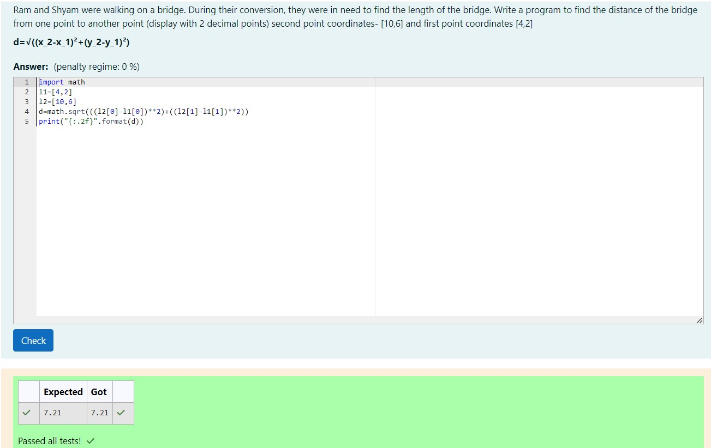

# DISTANCE-BETWEEN-TWO-POINTS

## AIM:
To write a python program to find the distance two 2 points

## ALGORITHM:

### Step 1: 
Import math function to calculate the sqaureroot value.

### Step 2: 
Assign two variables with given values.

### Step 3: 
Substitute the values in the distance formula  

### Step 4: 
Display the value by using print function.

### Step 5: 
Check the program and print the output.

### PROGRAM:
```
Program developed by:Easwari M
Register no:212223240033
```
```import math
l1=[4,2]
l2=[10,6]
d=math.sqrt(((l2[0]-l1[0])**2)+((l2[1]-l1[1])**2))
print("{:.2f}".format(d))
```

### OUTPUT:


### RESULT:

The output of the program has been successfully obtained.
